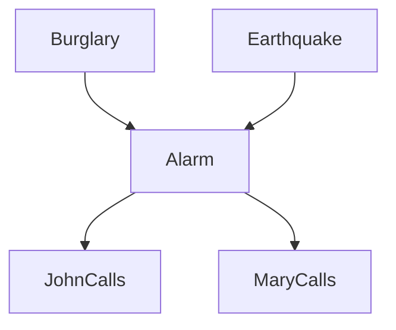
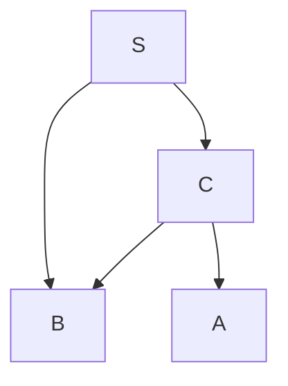

# Slide Answers (20/04/23)

**To calculate joint probability:**

$$P(x_1,...,x_n)=\prod^n_{i=1}P(x_i|parents(X_i))$$

## Slide 7
$$
P(c)P(I=medium)P(\neg b)P(s)P(\neg g|I=medium, c, \neg b)P(L=low|s, \neg g)
$$

## Slide 12
$\alpha$ is a normalization factor.

We provide a sample network:

$$\text{Fig.1 Sample network diagram}$$

And, the tables for probabilites,

|P(b)|
|:-:|
|0.001|

|P(e)|
|:-:|
|0.001|

|B|E|P(a)|
|:-:|:-:|:-:|
|T|T|0.95|
|T|F|0.94|
|F|T|0.29|
|F|F|0.001|

|A|P(j)|
|:-:|:-:|
|T|0.90|
|F|0.05|

|A|P(m)|
|:-:|:-:|
|T|0.70|
|F|0.01|

* P(~b,e,a,~j,m)
  $$P(\neg b)P(e)P(a|\neg b, e)P(\neg j|a)P(m|a)$$

* P(b,j,m)
  $$P(b)\sum_EP(E)\sum_AP(A|b,E)P(j|A)P(m|A)$$

* P(a|j,m)
  $$\alphaP(j|a)P(m|a)\sum_BP(B)\sum_EP(E)P(a|B,E)$$

* P(~a|b,j)
  $$\alpha P(b)P(j|\neg a)\sum_EP(E)P(\neg a|b,E)\sum_MP(M|\neg a)$$
  
**Note:** The position of each factors may affect heavily when working on inferencing using enumeration. These might not be the best answers, so be sure to practice!

## Slide 15
Reference the $\text{Fig.1}$ graphic,

Before the answer, here's how we can calculate the exact inference probability, for example we want caculate $P(B|j,m)$

```math
P(b|j,m)
=
\alpha P(b)\sum_EP(E)\sum_AP(A|b,E)P(j|A)P(m|A)
=
\alpha\cdot0.001\cdot
\left[
\begin{aligned}
&^{E=T}0.002 \cdot
\left[
\begin{aligned}
&{^{A=T}(0.95\cdot0.9\cdot0.7)} \\
&+ \\
&{^{A=F}(0.05\cdot0.05\cdot0.01)}
\end{aligned}
\right] \\
&+ \\
&^{E=F}0.998 \cdot
\left[
\begin{aligned}
&{^{A=T}(0.94\cdot0.9\cdot0.7)} \\
&+ \\
&{^{A=F}(0.06\cdot0.05\cdot0.01)}
\end{aligned}
\right]
\end{aligned}
\right]
```

```math
P(\neg b|j,m)
=
\alpha P(\neg b)\sum_EP(E)\sum_AP(A|b,E)P(j|A)P(m|A)
=
\alpha\cdot0.999\cdot
\left[
\begin{aligned}
&^{E=T}0.002 \cdot
\left[
\begin{aligned}
&{^{A=T}(0.29\cdot0.9\cdot0.7)} \\
&+ \\
&{^{A=F}(0.71\cdot0.05\cdot0.01)}
\end{aligned}
\right] \\
&+ \\
&^{E=F}0.998 \cdot
\left[
\begin{aligned}
&{^{A=T}(0.001\cdot0.9\cdot0.7)} \\
&+ \\
&{^{A=F}(0.999\cdot0.05\cdot0.01)}
\end{aligned}
\right]
\end{aligned}
\right]
```

Now we provide a new sample network,


$$\text{Fig.2 Sample network diagram for slide 15}$$

And, the tables for probabilites,

|P(s)|
|:-:|
|0.55|

|S|P(c)|
|:-:|:-:|
|T|0.2|
|F|0.1|

|S|C|P(b)|
|:-:|:-:|:-:|
|T|T|0.8|
|T|F|0.2|
|F|T|0.9|
|F|F|0.3|

|C|P(a)|
|:-:|:-:|
|T|0.8|
|F|0.2|

We want to find P(b|c,~a)

<!-- TODO: Add answer for slide 15 -->
```math
P(b|c,\neg a)
=
\alpha P(\neg a|c)\sum_SP(S)P(c|S)P(b|c,S)
=
\alpha\cdot0.2\cdot
\left[
\begin{aligned}
&^{S=T}(0.55\cdot0.2\cdot0.8) \\
&+ \\
&^{S=F}(0.45\cdot0.1\cdot0.9)
\end{aligned}
\right]
```

Additionally, if we want to know the inverse, P(~b|c,~a)

```math
P(\neg b|c,\neg a)
=
\alpha P(\neg a|c)\sum_SP(S)P(c|S)P(\neg b|c,S)
=
\alpha\cdot0.2\cdot
\left[
\begin{aligned}
&^{S=T}(0.55\cdot0.2\cdot0.2) \\
&+ \\
&^{S=F}(0.45\cdot0.1\cdot0.1)
\end{aligned}
\right]
```
