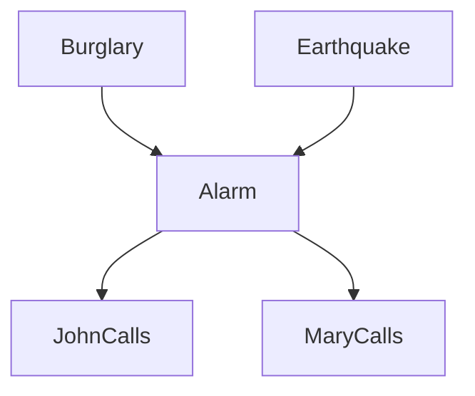

# Slide Answers (20/04/23)

**To calculate joint probability:**

$$P(x_1,...,x_n)=\prod^n_{i=1}P(x_i|parents(X_i))$$

## Slide 7
$$
P(c)P(I=medium)P(\neg b)P(s)P(\neg g|I=medium, c, \neg b)P(L=low|s, \neg g)
$$

## Slide 12
We provide a sample network:

* P(~b, e, a, ~j, m)
  $$P(\neg b)P(e)P(a|\neg b, e)P(\neg j|a)P(m|a)$$

* P(b, j, m)
  $$P(b)\sum_EP(E)\sum_AP(A|b,E)P(j|A)P(m|A)$$

* P(a|j, m)
  $$a\sum_BP(B)\sum_EP(E)P(a|B,E)P(j|a)P(m|A)$$

* P(~a|b, j)
  $$aP(b)\sum_EP(E)P(\neg a|b,E)P(j|\neg a)\sum_MP(M|\neg a)$$
